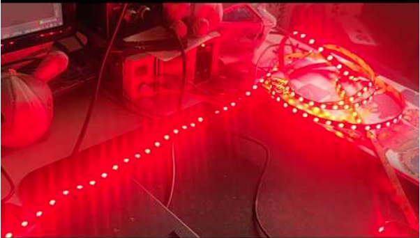
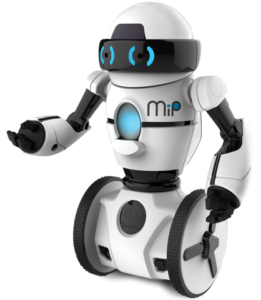

# Gophercon.EU 2024

The is the repository for the hardware hack session at Gophercon.EU 2024.

https://gophercon.eu/

### If you ordered a Gopher Badge, it is yours to keep. Please return all other equipment when you are finished for the next person. Thank you!

## Installation

Please read our [installation instructions here](./INSTALL.md).

## Activities

### Gopher Badge Hacking

If you are one of the very fortunate individuals to have ordered a Gopher Badge, it is in fact yours to keep!

Go to https://gopherbadge.com/ for more info.

### TinyGo LED Race

Virtual racing using real LEDs!

https://github.com/conejoninja/ledrace

### Parrot Minidrones

We have Parrot Minidrones you can fly with Go code to control them using their built-in Bluetooth API.

Post in-flight videos using hashtag #gopherconeu

Ready for takeoff? Go to [./drone/minidrone/](./drone/minidrone/).

### WowWee MiP robots

Along for the ride, we brought a couple of WowWee MiP two-wheeled self-balancing robots that you control using Bluetooth.

Post robot videos using hashtag #gopherconeu

Ready to roll? Go to [./robot/mip](./robot/mip/).

### TinyGo IoT sensors

Looking for the true "parts experience"? Got you covered! We have brought some Arduino Nano RP2040 Connect IoT microcontroller boards for each person to use for the activity.

https://store.arduino.cc/collections/boards/products/arduino-nano-rp2040-connect

These can be programmed using TinyGo.

There are some Grove sensor kits that you can use for the activity.

Ready to try this out? Go to [./sensor/arduino/](./sensor/arduino/) to get started.

### TinyGo Music Jam

Make your own electronic musical instruments using TinyGo and the Raspberry Pi Nano boards.

Thanks to the USB-MIDI support, you can turn your board into a tiny digital musical instrument controller.

Add buttons, sliders, a joystick, and when we say become part of the music we mean it!

Let's make beautiful music together, just go to [./musicjam/](./musicjam/).

## Bounties

We have some additional bounties and prizes, [you can see more information here](./BOUNTIES.md).

## License

Copyright (c) 2015-2024 The Hybrid Group and friends. Licensed under the MIT license.
